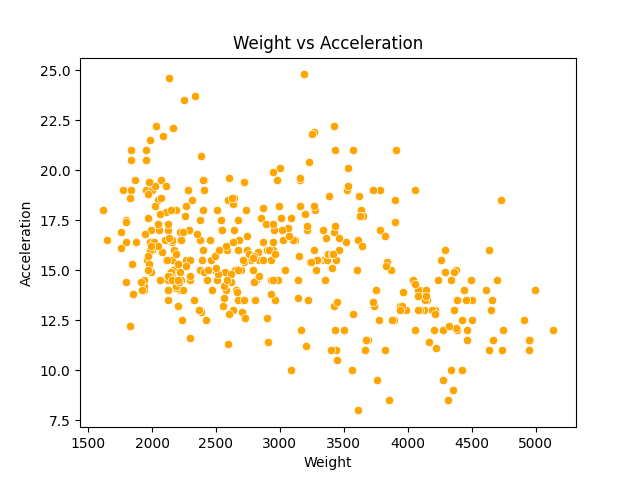

# MPG Prediction Project

## Problem Statement

- Provide a brief background or context for your analysis. Explain why the data is relevant or interesting.

- Clearly state the purpose of your analysis. What are you aiming to achieve or communicate through this analysis? Who would this benefit?

## Data Dictionary

| Variable Name | Description                                                                            | Units                                   |
| ------------- | -------------------------------------------------------------------------------------- | --------------------------------------- |
| cylinders     | number of [cylinders](https://en.wikipedia.org/wiki/Cylinder_%28engine%29) the car has | discrete number                         |
| displacement  | [engine displacement](https://en.wikipedia.org/wiki/Engine_displacement)               | cubic inches                            |
| horsepower    | [engine power](https://en.wikipedia.org/wiki/Horsepower) of the car                    | horsepower                              |
| weight        | weight of car                                                                          | pounds                                  |
| acceleration  | elapsed time to go from 0 to 60 miles per hour                                         | seconds                                 |
| mpg           | Target variable                                                                        | [mpg](https://www.kbb.com/what-is/mpg/) |

## Executive Summary

### Data Cleaning Steps

There were missing values for the horsepower, and those were dropped, as the number of missing values was small (only 6).

### Key Visualizations

Include key visualizations that highlight important aspects of the data. Use graphs, charts, or any other visual representation to make your points.

#### Visualization 1: [Weight vs Acceleration]

This visualization shows a scatterplot of the weight of the car vs the acceleration of the car. We can see that there is a downward trend, where as the weight increases, the acceleration decreases.

## Conclusions/Recommendations

Summarize the main findings from your analysis. If applicable, provide recommendations based on the insights gained from the data.

## Additional Information

Source [Web](https://archive.ics.uci.edu/ml/machine-learning-databases/auto-mpg/auto-mpg.data)
